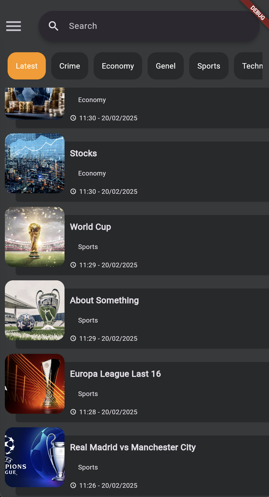

# WordPress News App DEMO

### Description
We have the right to take legal action in the event that the application is shared on the internet, distribution, claiming right ownership, selling it for a fee.
These codes are shared only for you to learn the Flutter.
Anyone who have access to the codes is agreed to have unconditionally accepted these terms.

All Rights Reserved. 
APPBeta Mobile - www.APPBeta.net - Berk ORHAN BETA

English (EN):
* Include's State management method like Get, Provider.
* Used Dio package for API communication.
* I'm not included Register, Login page codes and APIs.
* Firebase notification, Admob integration is also not included.
* You can freely customize, add new features to this code and used it for only personal use.

## About Application
English (EN):
- Framework: Flutter
- Programming Language: Dart
- Platform: Android, iOS, Web
- API: WP-Json V2
This system is developed using Flutter for three different platforms. It ensures secure communication with the database through the PHP JSON API.

## Screenshots from Application

